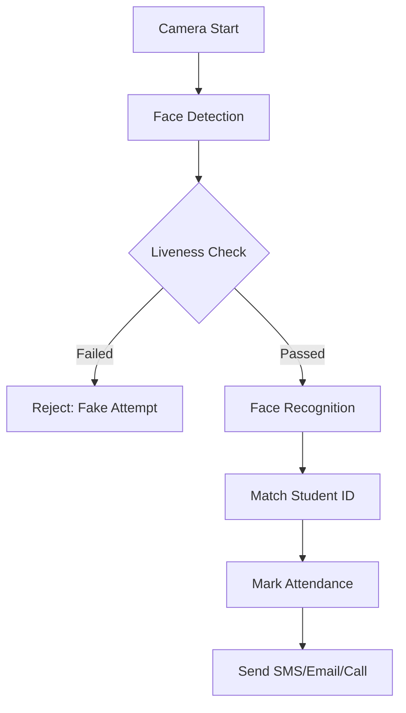

# Anti-Spoofing & Liveness Detection

Your AI Attendance System is designed with advanced Computer Vision principles to prevent "Photo Cheating" (Spoofing). This ensures that only physically present students can mark attendance.

## 🛡️ Preventing Fake Attendance
In standard face recognition, students might attempt to cheat using:
- **Mobile Photos**: Holding up a phone with a picture.
- **Printed Photos**: Using a paper printout.
- **Videos**: Replaying a video of a student's face.

## 🧠 How the System Detects Cheating
The system utilizes **Liveness Detection** to verify a human presence:

### 1. Eye Blink Detection 👁️
- **Logic**: Real humans blink naturally. Photos do not.
- **Implementation**: The system monitors the **Eye Aspect Ratio (EAR)** using 68-point face landmarks. 
- **Rule**: If the EAR drops significantly and recovers (a blink), the person is verified as "Real".

### 2. Head Movement Detection 🔄
- **Logic**: A flat photo cannot change perspective.
- **Requirement**: The system can prompt the student to "Turn Left" or "Look Up".
- **Verification**: If the landmark geometry changes according to the prompt, the attempt is verified.

### 3. 3D Depth & Texture Analysis
- **Logic**: AI models (like SsdMobilenetv1) are trained to distinguish between the texture of skin and the pixels/glare of a screen or paper.

## 🚀 Smart Attendance Workflow

## 📊 Success Scenarios

### Verified Student (Pravin)
- **Detection**: Blink Detected ✅
- **Match**: Pravin (98%) ✅
- **Action**: Attendance Marked.

### Spoofing Attempt
- **Detection**: Static Image Detected (No Blink) ❌
- **Action**: **Attendance Rejected.** Alert: "Fake attempt detected".
